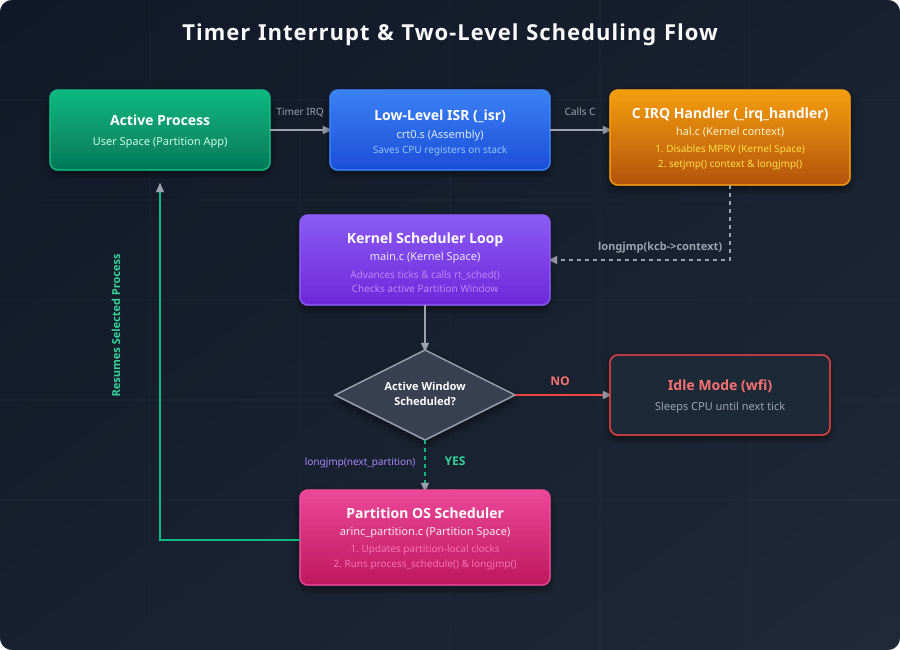

# UCX/OS ARINC 653
**ARINC 653** is a widely used avionic standard for critical system. 
This standard ensures spatial and temporal isolation between program, thanks to a robust partition system and a two-level scheduler (one for partitions and one for processes).

This project is the adaptation of UCX/OS to the **ARINC 653** standard.

## Table of Contents

- [PolarFire SoC Support](#polarfire-soc-support)
- [Supported Toolchains](#supported-toolchains)
- [Building Example Applications](#building-example-applications)
- [Understand Static Configuration](#understand-static-conf)
  - [1. The Header File: `static_conf.h`](#1-the-header-file-static_confh)
  - [2. The Source File: `static_conf.c`](#2-the-source-file-static_confc)
- [System Boot Sequence](#system-boot-sequence)
- [How Inter-Partition Communication Works](#how-inter-partition-communication-works)
  - [1. Concepts: Ports and Channels](#1-concepts-ports-and-channels)
  - [2. Communication Modes](#2-communication-modes)
  - [3. Example Mapping](#3-example-mapping)
- [How Timer Interrupts and Scheduling Work](#how-timer-interrupts-and-scheduling-work)
- [How to Add a New Partition](#how-to-add-a-new-partition)
  - [Step 1: Update the Linker Script (`.ld`)](#step-1-update-the-linker-script-ld)
  - [Step 2: Configure the Partition in `static_conf.h`](#step-2-configure-the-partition-in-static_confh)
  - [Step 3: Implement the Partition Entry Point](#step-3-implement-the-partition-entry-point)
  - [Step 4: Instantiate the Partition in the Application Main](#step-4-instantiate-the-partition-in-the-application-main)
- [Test ARINC 653](#test-arinc-653)
- [Debug an Application](#debug-an-application)


UCX/OS is a preemptive nanokernel RTOS for microcontrollers, aimed to be easily ported. The kernel implements a lightweight multitasking environment in a single address space (based on tasks and coroutines), using a minimum amount of resources.

Currently, UCX/OS supports the following targets:

#### RISC-V (32 / 64 bit)
- RV32I (Qemu) / RV32IMA (SMP)
- RV64I (Qemu) / RV64IMA (SMP)
- HF-RISCV (RV32E / RV32I)
- PolarFire SoC (Discovery Kit)

#### ARM (32 bit)
- Versatilepb (Qemu)
- STM32F401 / STM32F411 (BlackPill, Nucleo)
- STM32F407 (Discovery)

#### MIPS (32 bit)
- HF-RISC

#### AVR (8 bit)
- ATMEGA328p (Arduino Nano)
- ATMEGA2560 (Arduino Mega)
- ATMEGA32

## PolarFire SoC Support

For detailed, step-by-step instructions on how to set up the project, compile the code, configure search paths, and run benchmarks on the **PolarFire SoC Discovery Kit** using **Microchip SoftConsole**, please refer to the dedicated setup guide at **`arch/riscv/PolarFire/README.md`**.

## Supported toolchains

Different toolchains based on GCC and LLVM can be used to build the kernel and applications. If you want to build a cross-compiler from scratch, check the *sjohann81/toolchains* repository for build scripts.


## Building example applications

In order to build the examples, a cross compiler toolchain has to be installed in the build machine. This toolchain will be used to assemble and compile the kernel sources, as well as user application sources and to build a single binary image that can be uploaded to a board or run in a simulator. The build process will generate several files in the *build/target* directory. In order to simplify recurrent application builds, the OS is compiled into a static library (libucxos.a) and application objects are linked with this library in the final build stage.

You can use several **arinc 653** application:
* **arinc_app**: the basic app where you can develop on it
* **arinc_app_demo1**: a basic waker and worker app with a sensor periodic reader
* **arinc_app_demo2**: test the error handler at different level
* **arinc_app_demo3**: a round robin test on two aperiodic processes
* **arinc_app_demo4**: communication interpartition between partition 1 and partition 2

To build an **arinc 653** application on **qemu** by using **riscv-64** architecture type: '*make all ARINC_APP_TARGET=arinc_application_name*'

This target will:
* Remove previous OS files
* Copy the right *static configuration* into the current static configuration file
* Compile the OS to the target *riscv64-qemu*
* Link the application to the OS
* Launch the application with the duration *DURATION* specified in Makefile variable (by default 1s)
* Save the logs into the *./debug/test.txt* file

## Understand static conf

To achieve strict conformance with the **ARINC 653** standard, the system relies entirely on static configuration defined at module integration time. This design prevents any dynamic memory allocation (like `malloc` or `free`) during runtime, ensuring predictability, temporal/spatial isolation, and determinism.

The static configuration is split between two files: `static_conf.h` and `static_conf.c`.

### 1. The Header File: `static_conf.h`

This file declares the structures, static memory blocks, and constant definitions that describe the entire system topology.

#### Partition Configuration (`struct PartitionConfig`)
Each partition is configured statically using this structure:
* **Identification & Attributes**: Partition name, ID, assigned core count, and system partition flag (`is_system_partition`).
* **Temporal Properties**: Scheduling period and duration.
* **Spatial Memory Mapping**: Links partition segments to linker script symbols (`_p1_code_start`, `_p1_data_start`, etc.), establishing strict boundary checks.
* **Static Resource Arrays**: Pre-allocated arrays of fixed sizes for all partition resources (sampling/queuing ports, blackboards, buffers, semaphores, events, mutexes, and error lists). 

#### Module Scheduler Configuration
* **Major Frame (MZF)**: Configured via `DEFAULT_MAJOR_FRAME_TICK` (e.g., 100ms).
* **Scheduling Plan**: Defined by `DEFAULT_WINDOWS[]`, specifying window start times, durations, and whether periodic processes should start at window entry.

#### Inter-Partition Communication (IPC) Channels
* Port mapping is defined by `system_port_table[]` (a routing table) which links logical partition ports (e.g., `P1_OUT_TEMP`) to shared communication channels (`channel_temperature` for sampling, `channel_cmds` for queuing).

#### Intra-Partition Communication & Synchronization
* All synchronization and message-passing mechanisms between processes within the same partition are statically configured and pre-allocated:
  * **Blackboards**: Configured via `blackboard_configs[]`, defining logical names (e.g., `"BB1"`) and max message sizes. Static buffers (`p1_blackboards_data`) are pre-allocated to avoid heap allocation.
  * **Buffers**: Configured via `buffer_configs[]`, specifying max message count, max message size, and queuing discipline (FIFO/PRIORITY). Static memory blocks (`p1_buffers_data`) back these queues.
  * **Semaphores & Mutexes**: Defined via `semaphore_configs[]` and `mutex_configs[]`, setting initial/max values, lock priority, and queuing discipline for process synchronization.
  * **Events**: Declared in `event_configs[]` to handle binary state-change notifications among partition processes.

#### Health Monitor (HM) Tables
* Error action tables (`hm_table_partition_1`, `hm_table_partition_2`, `hm_table_module`) map avionic exceptions (e.g., `DEADLINE_MISSED`, `APPLICATION_ERROR`, `NUMERIC_ERROR`) to recovery actions (e.g., `IGNORE`, `PROCESS_RESTART`, `PROCESS_STOP`, `PARTITION_RESTART`) depending on the current operating mode.


### 2. The Source File: `static_conf.c`

This file implements the initial entry points and operational procedures for each partition.

#### Partition Entry Points
* Declares partition entry functions such as `p1_main_process()` and `p2_main_process()`.
* These functions execute under the `COLD_START` or `WARM_START` initialization modes.

#### Resource Instantiation Flow
During the initialization phase (prior to normal execution), the partition main processes invoke APEX services:
1. **Creation**: Call creation routines (`CREATE_PROCESS`, `CREATE_SAMPLING_PORT`, `CREATE_SEMAPHORE`, etc.). These routines populate the statically pre-allocated arrays in `static_conf.h` rather than allocating new heap blocks.
2. **Starting**: Processes are set to the `READY` state via `START()`.
3. **Transition to Normal Mode**: The partition transition is finalized by calling `SET_PARTITION_MODE(NORMAL, &return_code)`. This enables the partition's internal process scheduler, starting process execution.


## System Boot Sequence

The startup and boot sequence of the OS follows a strict multi-stage initialization path, transitioning from bare-metal hardware assembly setup to the kernel scheduler, partition registration, and finally launching partition processes.

### 1. Assembly Entry and Low-Level Setup (`crt0.s`)
* **Stack Pointer initialization**: The CPU executes the `_entry` section in **crt0.s** file. It initializes the stack pointer (`sp`) and clears the `.bss` section in RAM.
* **Interrupt Trap Setup**: The machine trap vector address (`mtvec`) is configured to point to the low-level interrupt service routine `_isr`.
* **Execution Jump**: The assembly code jumps to the C code entry point `main()`.

### 2. Kernel Initialization (`main.c`)
* The core logic is defined in `main()` in **main.c** file:
  * **Hardware Setup**: Configures architecture-specific registers and clocks (`_hardware_init()`).
  * **Health Monitor**: Initializes logging and the global health monitoring control block (`hm_init()`).
  * **Memory Heap**: Initializes the kernel memory allocator heap (`ucx_heap_init()`).
  * **Temporal Windows Layout**: Calls `module_scheduler_init()` to set up the major frame scheduling windows (`DEFAULT_WINDOWS[]`).
  * **Core Tasks List**: Allocates the kernel control block structures (`kcb->tasks` and `kcb->partitions`).
  * **Application Main Hook**: Invokes `app_main()`.

### 3. Partition Registration (`app_main()` and `partition_init()`)
* **Partition Size Calculation**: In **arinc_app.c** file, the sizes of code and data segments for each partition are calculated using the linker script bounds.
* **Registration**: For each partition, `partition_init()` (implemented in **partition.c** file) is called:
  * Allocates the Partition Control Block (`struct pcb_s *new_pcb`), status block, and memory requirement descriptors.
  * Binds the partition's kernel scheduling task to the kernel entry thread `partition_OS()`.
  * Saves the partition's user entry point (e.g., `p1_main_process`).
  * Appends the new partition to the kernel tasks and partitions list (`kcb->tasks` and `kcb->partitions`).
  * Statically configures the partition's sampling/queuing ports, blackboards, buffers, semaphores, events, and mutexes.

### 4. Scheduler Execution (`main.c`)
* After `app_main()` returns, the kernel calls `arinc_start_scheduling()` which configures the hardware CLINT timer to start periodic timer ticks.
* The main loop uses the `setjmp` / `longjmp` mechanism:
  * Evaluates the scheduling windows (`kcb->rt_sched()`).
  * If a partition is active, it performs a context jump (`longjmp`) to the partition entry point `partition_OS()`.

### 5. Partition Entry and Process Spawning (`arinc_partition.c`)
* Execution enters `partition_OS()` in **arinc_partition.c** file.
* Since the partition operating mode is initialized to `COLD_START`, the kernel immediately calls the partition's entry point (e.g., `p1_main_process()` in **static_conf.c** file).
* **Process Creation**: The main process executes the static configuration:
  * Invokes `CREATE_PROCESS()` for each internal process, allocating stacks and priorities.
  * Calls `CREATE_SAMPLING_PORT()`, `CREATE_QUEUING_PORT()`, or other intra/inter-partition resources inside the pre-allocated structures.
  * Launches the created processes using `START()`.
  * Transitions the operating mode using `SET_PARTITION_MODE(NORMAL, &return_code)`.
* Once in `NORMAL` mode, `partition_OS()` runs the process scheduler (`process_schedule()`), executing the application processes.

---


## How inter partition communication works

Inter-partition communication (IPC) in this OS complies with the **ARINC 653 APEX** specifications and operates using **Ports** at the partition level connected via **Channels** at the kernel level.

### 1. Concepts: Ports and Channels

* **Ports**: Logical entry/exit points defined within partitions. A port has a unique name, a direction (`SOURCE` or `DESTINATION`), and a type (Sampling or Queuing).
* **Channels**: Kernel-level communication structures that link a single `SOURCE` port to one or more `DESTINATION` ports.
* **Routing Table (`system_port_table[]`)**: Defined in `static_conf.h`, this table acts as the configuration-time map, linking logical partition ports to their corresponding kernel channels.

### 2. Communication Modes

#### A. Sampling Ports
Sampling communication is state-oriented and uses a single-message buffer where the latest message overwrites the previous one.
* **Writing (`WRITE_SAMPLING_MESSAGE`)**: Copies data from the source partition directly into the kernel channel's buffer, updating the timestamp.
* **Reading (`READ_SAMPLING_MESSAGE`)**: Reads the current message from the channel. Reading does not consume the message, allowing multiple reads. The reader calculates the message age:
  $$\text{Age} = \text{Current Time} - \text{Last Update Time}$$
  If the age is less than or equal to the port's `refreshPeriodMs`, the message is marked `VALID`; otherwise, it is marked `INVALID`.

#### B. Queuing Ports
Queuing communication is message-oriented and relies on a bounded queue (FIFO or Priority) where writing appends to the queue and reading consumes (removes) messages.
* **Sending (`SEND_QUEUING_MESSAGE`)**: Appends a message to the queuing channel. If the queue is full, the sending process blocks and enters the port's `waiting_processes` queue (respecting FIFO or Priority ordering).
* **Receiving (`RECEIVE_QUEUING_MESSAGE`)**: Consumes the oldest message. If the queue is empty, the receiving process blocks until a message is sent or its `TIME_OUT` expires.

#### C. Unblocking Blocked Processes
When scheduling windows transition or tick updates occur, the kernel runs `check_available_resources_on_partition_port()`. This function inspects queuing channels:
* If a channel has available slot space, it unblocks the highest priority process waiting to send.
* If a channel receives new messages, it unblocks the process waiting to receive.


### 3. Example Mapping

Based on `system_port_table[]` in `static_conf.h`:

* **Sampling Channel (`channel_temperature`)**:
  * **Source**: Port `"P1_OUT_TEMP"` in Partition 1 writes the temperature.
  * **Destination**: Port `"P2_IN_TEMP"` in Partition 2 reads the temperature.
* **Queuing Channel (`channel_cmds`)**:
  * **Source**: Port `"P2_OUT_CMDS"` in Partition 2 sends commands.
  * **Destination**: Port `"P1_IN_CMDS"` in Partition 1 receives commands.


## How timer interrupts and scheduling work

To maintain strict temporal and spatial isolation, the kernel relies on hardware timer interrupts and a two-level context switching mechanism.

The following flowchart and step-by-step breakdown describe what happens at each timer interrupt:

### Step-by-Step Flow



### 1. Hardware Interrupt Entry
* When the hardware timer comparison register `mtimecmp` matches `mtime`, a timer interrupt triggers.
* The CPU vector table routes execution immediately to the low-level interrupt service routine (`_isr` in **crt0.s** file).

### 2. Context Saving & Kernel Transition
* **General-Purpose Register Dump**: `_isr` saves the active CPU registers (`ra`, `t0`-`t6`, `a0`-`a7`) onto the stack of the currently executing partition.
* Inside the C handler `_irq_handler` in **hal.c** file, the timer comparison register is reloaded for the next tick:
  $$\text{mtimecmp} = \text{mtime} + \left( \frac{F\_CPU}{F\_TIMER} \right)$$

### 3. Yielding to the Kernel Module Scheduler
* **Saving Partition Context**: The handler checks if a partition was active (`kcb->partition_current != NULL`). If so, it saves the partition's execution context into `current_partition->tcb.context` using `setjmp()`.
* **Switching Execution Thread**: The handler performs a `longjmp(kcb->context, 1)` to return control to the main kernel scheduler loop in **main.c** file.

### 4. Running the Two-Level Scheduler
* **Module-Level Scheduling (Temporal Isolation)**:
  * The kernel increments the execution tick count (`kcb->ticks++`).
  * It runs `kcb->rt_sched()` to evaluate the current scheduling plan. It checks `DEFAULT_WINDOWS[]` to determine which partition window is active.
  * If the active window changes, `kcb->partition_current` is updated.
* **Idle Mode**: If no partition window is scheduled for the current tick, the kernel runs `_cpu_idle()`, which executes the `wfi` (Wait For Interrupt) instruction to put the processor in a low-power sleep state until the next timer tick.
* **Transitioning to Partition OS**: If a partition window is active, the kernel performs a `longjmp(next_partition->tcb.context, 1)`.

### 5. Running the Intra-Partition Scheduler
* Execution resumes inside the partition context at `partition_OS()` in **arinc_partition.c** file.
* **Process-Level Scheduling (Spatial Isolation)**:
  * The partition OS updates its local timers (`arinc_time_update_partition`).
  * It runs `process_schedule()` to select the next `READY` process based on priority and deadline.
  * It restores the selected process context from its TCB context block, returning execution to the application code.


## How to add a new partition

Adding a new partition (e.g., `P3`) requires updating the spatial memory mapping, static structures, scheduler windows, entry point, and system initialization.

### Step 1: Update the Linker Script (`.ld`)
To guarantee spatial isolation, you must define dedicated code and data memory regions for the new partition.
1. Add new memory segments in the `MEMORY` block of your target linker script (e.g., `arch/riscv/riscv64-qemu/riscv64-qemu.ld`):
   ```ld
   p3_code (rx)  : ORIGIN = 0x85000000, LENGTH = 1M
   p3_data (rw)  : ORIGIN = 0x86000000, LENGTH = 64K
   ```
2. Define corresponding sections and export boundary symbols in the `SECTIONS` block:
   ```ld
   .p3_code : {
       _p3_code_start = .;  
       *(.p3_code)
       _p3_code_end = .;
   } > p3_code

   .p3_data : {
       _p3_data_start = .;
   } > p3_data
   _p3_data_end = ORIGIN(p3_data) + LENGTH(p3_data);
   ```

### Step 2: Configure the Partition in `static_conf.h`
1. **Import Linker Symbols**: Declare the new partition boundary symbols:
   ```c
   extern uint8_t _p3_code_start[];
   extern uint8_t _p3_code_end[];
   extern uint8_t _p3_data_start[];
   extern uint8_t _p3_data_end[];
   ```
2. **Define Resource Allocations**: Allocate static arrays for P3's resources:
   ```c
   static struct sampling_port_s p3_sampling_ports[MAX_NUMBER_OF_SAMPLING_PORTS];
   static struct queuing_port_s p3_queuing_ports[MAX_NUMBER_OF_QUEUING_PORTS];
   // Allocate blackboards, buffers, semaphores, events, mutexes, and error lists as needed...
   ```
3. **Declare the Partition Configuration**: Create a `P3_CONFIG` constant matching `struct PartitionConfig`:
   ```c
   static const struct PartitionConfig P3_CONFIG = {
       .period = 50,
       .duration = 20,
       .identifier = 3,
       .num_assigned_cores = 1,
       .name = "P3",
       .region_name_code_mem = "p3_code",
       .access_code_mem = "RX",
       .region_name_data_mem = "p3_data",
       .access_data_mem = "RW",
       .is_system_partition = (BOOLEAN_TYPE)false,
       .sampling_ports = p3_sampling_ports,
       .max_sampling_ports = MAX_NUMBER_OF_SAMPLING_PORTS,
       .sampling_port_count = 0,
       // Link other pre-allocated arrays and counts...
   };
   ```
4. **Update the Scheduling Plan**: Insert a scheduling window for P3 inside the `DEFAULT_WINDOWS[]` array and adjust window ticks so they fit within the Major Frame Tick (`DEFAULT_MAJOR_FRAME_TICK`):
   ```c
   {
       .name = "P3",
       .id = 3,
       .start_tick = MS_TO_TICKS(80),
       .duration_tick = MS_TO_TICKS(20),
       .is_periodic_processes_start = (BOOLEAN_TYPE)true,
   }
   ```

### Step 3: Implement the Partition Entry Point
1. **Declare Entry Point**: Declare the main process entry function in `static_conf.h`:
   ```c
   extern void p3_main_process(struct pcb_s *partition);
   ```
2. **Implement Entry Point**: Implement the function in `static_conf.c`, placing it in P3's dedicated code section:
   ```c
   __attribute__((section(".p3_code")))
   void p3_main_process(struct pcb_s *partition) {
       RETURN_CODE_TYPE return_code;
       PROCESS_ID_TYPE process_id;

       // 1. Create intra-partition resources (buffers, semaphores, etc.)
       // 2. Create processes
       CREATE_PROCESS(&P3_PROCESS_1_CONFIG, &process_id, &return_code);
       START(process_id, &return_code);

       // 3. Transition to NORMAL mode to start the process scheduler
       SET_PARTITION_MODE(NORMAL, &return_code);
   }
   ```

### Step 4: Instantiate the Partition in the Application Main
1. In your application file (e.g., `app/arinc_app.c`), compute the code and data sizes:
   ```c
   size_t p3_data_size = _p3_data_end - _p3_data_start;
   size_t p3_code_size = _p3_code_end - _p3_code_start;
   ```
2. Invoke `partition_init()` within `app_main()` to register P3 with the kernel:
   ```c
   partition_init(P3_CONFIG.period,
                  P3_CONFIG.duration,
                  P3_CONFIG.identifier,
                  P3_CONFIG.num_assigned_cores,
                  P3_CONFIG.name,
                  P3_CONFIG.region_name_code_mem,
                  (void*)_p3_code_start,
                  p3_code_size,
                  P3_CONFIG.access_code_mem,
                  P3_CONFIG.region_name_data_mem,
                  (void*)_p3_data_start,
                  p3_data_size,
                  P3_CONFIG.access_data_mem,
                  p3_main_process,
                  P3_CONFIG.is_system_partition,
                  P3_CONFIG.sampling_ports,
                  P3_CONFIG.max_sampling_ports,
                  P3_CONFIG.sampling_port_count,
                  P3_CONFIG.max_sampling_port_data_size,
                  // Pass other resources...
                 );
   ```


## Test ARINC 653
To test that everything is working with the correct behavior, you can run the test script : '*./testbench/run_arinc_tests.sh*', it will test the different functions of the ARINC 653 APEX.

## Debug an application 
To debug the current application compile with the os, you can run in one terminal '*make qemu_debug*' and in other one type '*make gdb*' or '*make multiarch-gdb*' depending on your computer. You can add a '*-g*' flag in *CFLAGS* of the Makefile to add debug symbole.